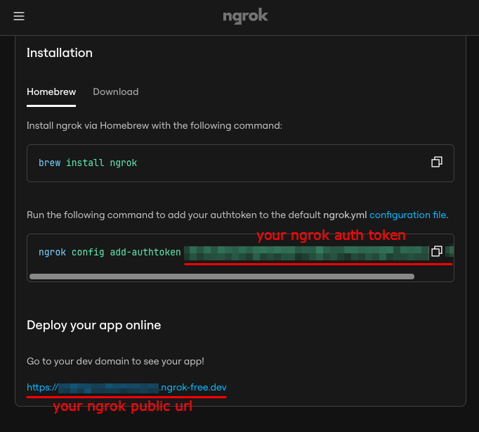
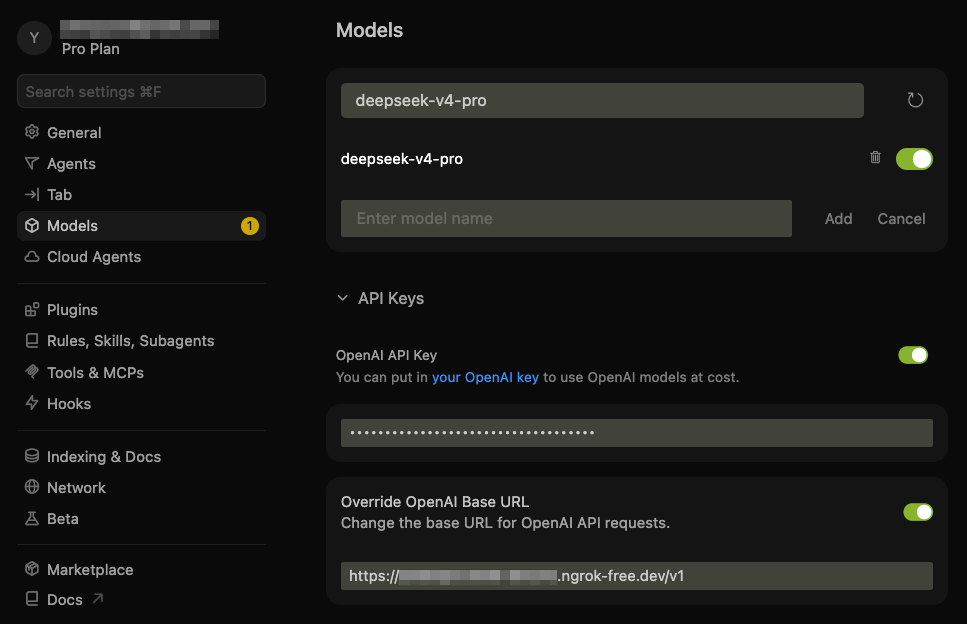

<h1> deepseek-cursor-proxy</h1>

Compatibility proxy connecting Cursor to DeepSeek thinking models (`deepseek-v4-pro` and `deepseek-v4-flash`).

## What It Does

- ✅ Caches DeepSeek `reasoning_content` from regular and streamed responses, then restores it on later tool-call turns when Cursor omits it. If old or mixed-model chat history cannot be repaired exactly, the proxy can recover by continuing from recent context and showing a small Cursor-visible notice. See [DeepSeek docs](https://api-docs.deepseek.com/guides/thinking_mode#tool-calls) for more details.
- ✅ Mirrors streamed `reasoning_content` into Cursor-visible `<think>...</think>` text so that thinking tokens are shown in Cursor's UI. For BYOK/proxy mode, Cursor renders this as normal text, not as a native collapsible thinking block.
- ✅ Starts an ngrok tunnel so Cursor can reach the local proxy through a public HTTPS URL.
- ✅ Provides other compatibility fixes to make DeepSeek models run well in Cursor.

## Why This Exists

This repository fixes the following Cursor + DeepSeek tool-call error with thinking mode enabled:


```txt
⚠️ Connection Error
Provider returned error:
{
  "error": {
    "message": "The reasoning_content in the thinking mode must be passed back to the API.",
    "type": "invalid_request_error",
    "param": null,
    "code": "invalid_request_error"
  }
}
```

## Usage

### Step 1: Set Up ngrok

Cursor blocks non-public API URLs such as `localhost`, so the proxy needs a public HTTPS URL. [ngrok](https://ngrok.com/) can expose the local proxy to Cursor without opening router ports. Alternatively, you may use [Cloudflare Tunnel](https://developers.cloudflare.com/tunnel/setup/).

Create an ngrok account, then visit ngrok's dashboard: https://dashboard.ngrok.com



Then, install and authenticate ngrok once:

```bash
brew install ngrok
ngrok config add-authtoken <your-ngrok-token>
```

### Step 2: Add Cursor Custom Model

In Cursor, add the DeepSeek custom model and point it at this proxy:

- Model: `deepseek-v4-pro`
- API Key: your DeepSeek API key
- Base URL: your ngrok HTTPS URL with the `/v1` API version path

The proxy respects the DeepSeek model name Cursor sends, such as `deepseek-v4-pro` or `deepseek-v4-flash`. The `model` field in `config.yaml` is used as a fallback only when a request does not include a model.

For example, if ngrok dashboard shows `https://example.ngrok-free.app`, use:

```text
https://example.ngrok-free.app/v1
```



Note: you can toggle the custom API on and off with:

- macOS: `Cmd+Shift+0`
- Windows/Linux: `Ctrl+Shift+0`

### Step 3: Install and Start the Proxy Server

**Run with UV**

```bash
# Install uv if you don't have it
curl -LsSf https://astral.sh/uv/install.sh | sh

# Install and start
# uv installs the program in .venv/ under the repo local folder
git clone https://github.com/yxlao/deepseek-cursor-proxy.git
cd deepseek-cursor-proxy
uv run deepseek-cursor-proxy
```

**Run with Conda**

```bash
# Install conda if you don't have it
# Follow: https://www.anaconda.com/docs/getting-started/miniconda/install/overview

# Install
conda create -n dcp python=3.10 -y
conda activate dcp
git clone https://github.com/yxlao/deepseek-cursor-proxy.git
cd deepseek-cursor-proxy
pip install -e .

# Start
deepseek-cursor-proxy
```

On start, `deepseek-cursor-proxy` will print the ngrok public URL. If it differs from the one in Cursor, update it in Cursor's Base URL field.

On the first run, `deepseek-cursor-proxy` will create:

- `~/.deepseek-cursor-proxy/config.yaml`: the configuration file
- `~/.deepseek-cursor-proxy/reasoning_content.sqlite3`: the reasoning content cache

### Step 4: Chat with DeepSeek in Cursor

Select `deepseek-v4-pro` in Cursor and use chat or agent mode as usual.


## How It Works

DeepSeek's [thinking mode](https://api-docs.deepseek.com/guides/thinking_mode#tool-calls) requires `reasoning_content` from assistant messages in tool-call sequences to be passed back in later requests. Cursor may omit this field, causing DeepSeek to return a 400 error. This proxy sits between Cursor and DeepSeek (`Cursor → ngrok → proxy → DeepSeek API`) and repairs requests when it has the exact original reasoning cached.

- Core fix: every DeepSeek response, streaming or non-streaming, has its `reasoning_content` stored in a local SQLite cache keyed by message signature, tool-call ID, and tool-call function signature. On outgoing thinking-mode requests, the proxy restores missing `reasoning_content` for tool-call-related assistant messages and sends the complete history to DeepSeek. If the cache is cold, such as after a proxy restart or model switch, the default recovery mode omits older unrecoverable tool-call history, continues from the latest user request, logs the recovery, and prefixes the next Cursor response with a small notice.
- Multi-conversation isolation: cache keys are scoped by a SHA-256 hash of the canonical conversation prefix (roles, content, tool calls, excluding `reasoning_content`) plus the upstream model/configuration and an API-key hash. Concurrent or interleaved threads with different histories get different scopes, so reused tool-call IDs do not collide. Byte-identical cloned histories are indistinguishable unless Cursor sends a differentiating history.
- DeepSeek [prefix caching](https://api-docs.deepseek.com/guides/kv_cache) compatibility: the proxy does not inject synthetic thread IDs, timestamps, or cache-control messages into the prompt. When it restores cached reasoning, it restores the exact original string, preserving repeated prefixes for DeepSeek's automatic best-effort context cache.
- Additional compatibility fixes: the proxy converts legacy `functions`/`function_call` fields to `tools`/`tool_choice`, preserves required and named tool-choice semantics, normalizes `reasoning_effort` aliases per DeepSeek docs, strips mirrored `<think>` blocks from assistant content, converts multi-part content arrays to plain text, logs DeepSeek prompt-cache usage when available, and mirrors `reasoning_content` into Cursor-visible `<think>...</think>` blocks for thinking display.

## Debugging

Normal logs avoid request/response bodies but still print compact request and usage statistics. `rounds` is the number of user turns in the forwarded history, `reasoning` is the number and character size of `reasoning_content` fields sent to DeepSeek, and `cache=hit/miss` comes from DeepSeek's `usage.prompt_cache_hit_tokens` / `prompt_cache_miss_tokens`.

Run with verbose output:

```bash
deepseek-cursor-proxy --verbose
```

Run without ngrok for local curl testing:

```bash
PROXY_NGROK=false deepseek-cursor-proxy --port 9000 --verbose
```

If the current chat contains thinking-mode tool-call history whose original DeepSeek `reasoning_content` is not in the local cache, the default `recover` mode avoids hard failure by dropping older unrecoverable tool-call history, forwarding the latest user request with a system recovery note, logging what happened, and prefixing the next assistant response with:

```text
[deepseek-cursor-proxy] Recovered this DeepSeek chat because older tool-call reasoning was unavailable; continuing with recent context only.
```

This commonly happens when continuing an older chat after a proxy restart, cache clear, cache format/config change, or switching from another model into DeepSeek. If you run strict debugging mode, the proxy returns `missing_reasoning_content` instead of recovering and the error message tells you to switch back to recover mode.

The recovery strategy is not a config-file setting. For strict DeepSeek API behavior while debugging, pass the runtime flag:

```bash
deepseek-cursor-proxy --verbose --missing-reasoning-strategy reject
```

To turn automatic recovery back on, restart without that flag or pass:

```bash
deepseek-cursor-proxy --verbose --missing-reasoning-strategy recover
```

Use another config file:

```bash
deepseek-cursor-proxy --config ./dev.config.yaml
```

Clear the local reasoning cache:

```bash
deepseek-cursor-proxy --clear-reasoning-cache
```

Run tests:

```bash
PYTHONPATH=src python -m unittest discover -s tests
```
